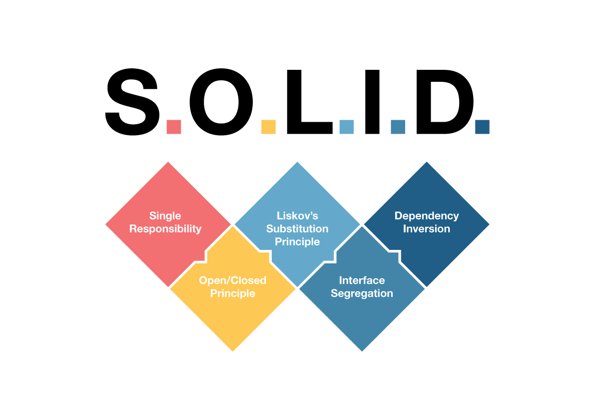

# SOLID-Principles



## Table of Contents

1. [Introduction](#introduction)
2. [S - Single Responsibility Principle)](#s-Single-Responsibility-Principle)
3. [O - Open/Closed Principle](#o-Open/Closed-Principle)
4. [L - Liskov’s Substitution Principle](#L-Liskov’s-Substitution-Principle) 
5. [I - Interface Segregation Principle](#I-Interface-Segregation-Principle) 
6. [D - Dependency Inversion Principle](#D-Dependency-Inversion-Principle)
7. [Conclusion](#Conclusion)

---

## Introduction

SOLID is an acronym for five design principles

1. S - Single Responsibility Principle (SRP)
2. O - Open/Closed Principle (OCP)
3. L - Liskov’s Substitution Principle
4. I - Interface Segregation Principle
5. D - Dependency Inversion Principle

These principles guide developers to create maintainable, flexible, and robust software systems. In this article, we will explore each of these principles in-depth, accompanied by practical code examples in C#.

## S - Single Responsibility Principle

The SRP states that a class should have only one reason to change, meaning it should have a single responsibility. This principle helps in maintaining code that is easier to understand, test, and maintain.

```C#
// Bad example violating SRP
public class Customer
{
    public void AddCustomer()
    {
        // Code to add a customer to the database
    }

    public void SendEmail()
    {
        // Code to send an email to the customer
    }
}

// Good example following SRP
public class CustomerService
{
    public void AddCustomer()
    {
        // Code to add a customer to the database
    }
}

public class EmailService
{
    public void SendEmail()
    {
        // Code to send an email to the customer
    }
}
```
In the given code example, we have a class called Customer that violates the Single Responsibility Principle (SRP). The Customer class is responsible for both adding a customer to the database and sending an email to the customer. This violates the SRP because the class has multiple reasons to change — if there are changes in the database operations or email sending logic, the Customer class would need to be modified.

To address this issue and follow the SRP, we can refactor the code by separating the responsibilities into two distinct classes: CustomerService and EmailService.

In the refactored code:

CustomerService class is responsible for adding a customer to the database. It contains a method called AddCustomer() that handles the database-related operations. By separating the database-related functionality into its own class, we adhere to the SRP, as the CustomerService class now has a single responsibility.

EmailService class is responsible for sending emails to customers. It contains a method called SendEmail() that handles the email sending logic. By moving the email-related functionality into its own class, we separate it from the database operations and adhere to the SRP.

By splitting the responsibilities into separate classes, we achieve better separation of concerns, which leads to more maintainable and flexible code. Now, if there are changes in the database operations or email sending logic, we only need to modify the respective class, minimizing the impact on other parts of the codebase.

## O - Open/Closed Principle

The OCP states that software entities (classes, modules, etc.) should be open for extension but closed for modification. It encourages the use of abstraction and inheritance to achieve this principle.

```C#
// Bad example violating OCP
public enum VehicleType
{
    Car,
    Motorcycle
}

public class Vehicle
{
    public VehicleType Type { get; set; }

    public double CalculateInsurancePremium()
    {
        double basePremium = 1000;

        // Calculate insurance premium based on vehicle type
        if (Type == VehicleType.Car)
        {
            return basePremium * 1.5;
        }
        else if (Type == VehicleType.Motorcycle)
        {
            return basePremium * 2;
        }

        return basePremium;
    }
}

// Good example following OCP
public abstract class Vehicle
{
    public abstract double CalculateInsurancePremium();
}

public class Car : Vehicle
{
    public override double CalculateInsurancePremium()
    {
        double basePremium = 1000;
        return basePremium * 1.5;
    }
}

public class Motorcycle : Vehicle
{
    public override double CalculateInsurancePremium()
    {
        double basePremium = 1000;
        return basePremium * 2;
    }
}
```

In the bad example, we have a Vehicle class that contains a VehicleType property and a method called CalculateInsurancePremium(). The method calculates the insurance premium based on the vehicle type, but it violates the OCP because whenever a new vehicle type is introduced, we need to modify the existing class.

In the good example, we apply the OCP by introducing an abstract Vehicle class. This abstract class provides a common interface with the method, CalculateInsurancePremium() which is declared as abstract. Then, we create two derived classes, Car and Motorcycle, which inherit from the Vehicle class and override the CalculateInsurancePremium() method.

By using this approach, the code becomes open for extension. If we want to add a new vehicle type (e.g., Truck), we can create a new class that derives from Vehicle and implements its own insurance premium calculation logic without modifying the existing code. This promotes code reusability and maintains the closed nature of the original Vehicle class, following the principles of OCP.

## L - Liskov’s Substitution Principle

The LSP states that objects of a superclass should be replaceable with objects of its subclasses without affecting the correctness of the program. In simpler terms, it ensures that derived classes can be used interchangeably with their base classes.

```c#
// Bad example violating LSP
public class Rectangle
{
    public int Width { get; set; }
    public int Height { get; set; }

    public virtual void SetWidth(int width)
    {
        Width = width;
    }

    public virtual void SetHeight(int height)
    {
        Height = height;
    }

    public int CalculateArea()
    {
        return Width * Height;
    }
}

public class Square : Rectangle
{
    public override void SetWidth(int width)
    {
        Width = width;
        Height = width;
    }

    public override void SetHeight(int height)
    {
        Width = height;
        Height = height;
    }
}

// Good example following LSP
public abstract class Shape
{
    public abstract int CalculateArea();
}

public class Rectangle : Shape
{
    public int Width { get; set; }
    public int Height { get; set; }

    public override int CalculateArea()
    {
        return Width * Height;
    }
}

public class Square : Shape
{
    public int SideLength { get; set; }

    public override int CalculateArea()
    {
        return SideLength * SideLength;
    }
}
```

In the given code example, we have a class hierarchy consisting of a Rectangle class and a derived Square class that violates the Liskov Substitution Principle (LSP). The Square class inherits from the Rectangle class, which may seem intuitive at first since a square is a special case of a rectangle. However, this inheritance relationship leads to a violation of LSP.

In the bad example, the Rectangle class has separate SetWidth() and SetHeight() methods, allowing the width and height to be set independently. The Square class overrides these methods to ensure that both the width and height are always equal, maintaining the square’s property.

However, this violates the LSP because the behavior of the Square class is not substitutable for the behavior defined by the Rectangle class:

```C#
Rectangle rectangle = new Square();
rectangle.SetWidth(5);
rectangle.SetHeight(3);

int area = rectangle.CalculateArea(); // Expected result: 15, Actual result: 9
```

In the good example, we adhere to the LSP by rethinking the class hierarchy and avoiding the inheritance relationship between Rectangle and Square. Instead, we introduce an abstract base class called Shape, which declares an abstract method CalculateArea().

In the refactored code:

Shape abstract class serves as a base class for different shapes and declares an abstract method CalculateArea(). By using an abstract class, we ensure that all derived shapes must implement the CalculateArea() method.

Rectangle class extends the Shape abstract class and overrides the CalculateArea() method. It introduces separate Width and Height properties and implements the area calculation specific to rectangles.

Square class also extends the Shape abstract class and overrides the CalculateArea() method. It introduces a SideLength property and implements the area calculation specific to squares.

By redesigning the class hierarchy, we avoid the inheritance relationship that violates the LSP. Each class now defines its own properties and implements the area calculation specific to its shape. The code becomes more cohesive and adheres to the LSP, allowing objects of the derived classes (e.g., Rectangle and Square) to be used interchangeably with objects of the base class (Shape).

## I - Interface Segregation Principle

The ISP states that clients should not be forced to depend on interfaces they do not use. It promotes the idea of segregating large interfaces into smaller and more specific ones.

```C#
// Bad example violating ISP
public interface IWorker
{
    void Work();
    void Eat();
    void Sleep();
}

public class Robot : IWorker
{
    public void Work()
    {
        // Code for performing work
    }

    public void Eat()
    {
        // Robots don't eat!
        throw new NotSupportedException();
    }

    public void Sleep()
    {
        // Robots don't sleep!
        throw new NotSupportedException();
    }
}

// Good example following ISP
public interface IWorker
{
    void Work();
}

public interface IEater
{
    void Eat();
}

public interface ISleeper
{
    void Sleep();
}

public class Human : IWorker, IEater, ISleeper
{
    public void Work()
    {
        // Code for performing work
    }

    public void Eat()
    {
        // Code for eating
    }

    public void Sleep()
    {
        // Code for sleeping
    }
}

public class Robot : IWorker
{
    public void Work()
    {
        // Code for performing work
    }
}
```
In the given code example, we have an interface called IWorker that represents a worker with three methods: Work(), Eat(), and Sleep(). This code violates the Interface Segregation Principle (ISP) because it forces implementers to provide implementations for methods that they don’t need or cannot support.

In the bad example, the IWorker interface is too broad and contains methods that are not applicable to all implementations. The Robot class implements the IWorker interface but throws NotSupportedException for the Eat() and Sleep() methods since robots don't eat or sleep. This violates the ISP because the Robot class is forced to implement methods that are irrelevant to its functionality, leading to empty or exception-throwing implementations.

In the good example, we apply the ISP by splitting the IWorker interface into three separate interfaces: IWorker, IEater, and ISleeper.

IWorker interface defines the Work() method, which represents the common behavior of workers.

IEater interface defines the Eat() method, which represents the behavior of entities that can eat.

ISleeper interface defines the Sleep() method, which represents the behavior of entities that can sleep.

Then, we have the Human class, which implements all three interfaces: IWorker, IEater, and ISleeper. Humans are capable of working, eating, and sleeping, so they implement all the corresponding methods.

Finally, we have the Robot class, which only implements the IWorker interface. Robots do not eat or sleep, so they do not need to implement the unnecessary methods.

By splitting the interfaces based on specific behaviour, we adhere to the ISP. Each class now implements only the interfaces that are relevant to its functionality, avoiding empty or exception-throwing implementations. This promotes better separation of concerns and allows for more precise client dependencies, ensuring that clients depend only on the interfaces they actually use.

## D - Dependency Inversion Principle

The DIP states that high-level modules should not depend on low-level modules; both should depend on abstractions. It encourages loose coupling between modules and facilitates easier unit testing and maintainability.

```C#
// Bad example violating DIP
public class DataAccess
{
    public void SaveData(string data)
    {
        // Code to save data to a specific database
    }
}

public class UserService
{
    private readonly DataAccess _dataAccess;

    public UserService()
    {
        _dataAccess = new DataAccess();
    }

    public void CreateUser(string username, string password)
    {
        // Code to create a user

        _dataAccess.SaveData("User created: " + username);
    }
}

// Good example following DIP
public interface IDataAccess
{
    void SaveData(string data);
}

public class DataAccess : IDataAccess
{
    public void SaveData(string data)
    {
        // Code to save data to a specific database
    }
}

public class UserService
{
    private readonly IDataAccess _dataAccess;

    public UserService(IDataAccess dataAccess)
    {
        _dataAccess = dataAccess;
    }

    public void CreateUser(string username, string password)
    {
        // Code to create a user

        _dataAccess.SaveData("User created: " + username);
    }
}
```

In the given code example, we have a UserService class that depends directly on the DataAccess class, violating the Dependency Inversion Principle (DIP).

In the bad example, the UserService class has a tight coupling with the DataAccess class. It creates an instance of DataAccess directly within its constructor, which tightly binds the UserService to the specific implementation of the data access logic. This violates the DIP because the UserService is dependent on a concrete implementation rather than an abstraction.

In the good example, we refactor the code to adhere to the DIP by introducing an interface called IDataAccess that abstracts the data access functionality. The DataAccess class implements this interface.

IDataAccess interface defines a contract for data access operations and contains the SaveData() method.

DataAccess class implements the IDataAccess interface and provides the concrete implementation for saving data to a specific database.

UserService class now depends on the IDataAccess interface instead of the concrete DataAccess class. The dependency is injected through the constructor, allowing for easier substitution of different implementations of IDataAccess. This constructor injection adheres to the DIP because the UserService depends on an abstraction (IDataAccess) rather than a specific implementation.

By introducing the IDataAccess interface and injecting it into the UserService class, we achieve loose coupling and higher flexibility. The UserService class is no longer tightly coupled to a specific implementation of data access, making it easier to switch or extend the data access logic without modifying the UserService class itself.

This adherence to the DIP allows for easier unit testing, better separation of concerns, and promotes the use of interfaces and abstractions to achieve more maintainable and extensible code.

## Conclusion

The SOLID principles provide valuable guidelines for designing maintainable and extensible software systems. By applying these principles, developers can create code that is easier to understand, test, and maintain.

Remember that these principles are not strict rules, but rather guiding principles that should be adapted to the specific requirements of each project. With the examples provided, you can start incorporating these principles into your codebase and enhance the overall quality of your software.


